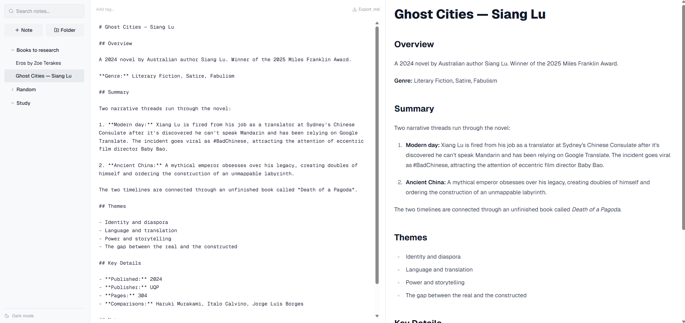
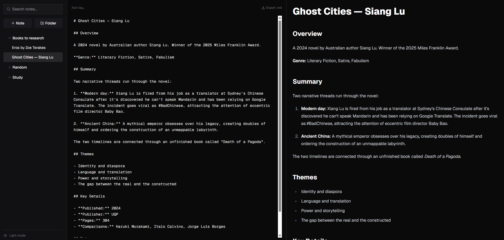

# Markdown Notes

A client-side markdown note-taking app built with Next.js. Supports folders, tags, full-text search, and live preview — all stored locally in IndexedDB.




**[Try it live](https://note-taking-app-zeta-ten.vercel.app/)**

## Features

- Markdown editing with live preview (GitHub Flavoured Markdown)
- Nested folder tree with inline rename
- Tag system with per-note persistence
- Full-text search across titles, body, and tags
- Auto-save with 500ms debounce
- Soft delete for notes and folders (cascade)
- Export notes as `.md` files
- Keyboard shortcuts for common actions
- Dark / light mode toggle (persisted in localStorage)
- Fully client-side — no server, no account, data stays in the browser

## Tech Stack

| Technology | Purpose |
|---|---|
| Next.js 16 | React framework |
| React 19 | UI library with the React Compiler enabled |
| Dexie.js 4 | IndexedDB wrapper for structured client-side storage |
| Tailwind CSS 4 | Utility-first styling with CSS variable theming |
| react-markdown + remark-gfm | Markdown rendering with GFM support |
| lucide-react | SVG icon library |
| TypeScript 5 | Type safety |

## Architecture

The app follows a four-layer pattern where each layer only talks to the one below it:

```
Components  (Sidebar, Editor, Preview)
     ↓
Hook        (useNote) — state, debounce, orchestration
     ↓
Services    (notes.ts, folders.ts) — CRUD, search, cascade delete
     ↓
Database    (Dexie → IndexedDB)
```

### Project structure

```
src/
├── app/
│   ├── layout.tsx          # root layout, theme script
│   ├── page.tsx            # layout shell, keyboard shortcuts
│   └── globals.css         # CSS variables, colour palette
├── components/
│   ├── Sidebar.tsx         # folder tree, note list, search, theme toggle
│   ├── Editor.tsx          # tag bar, markdown textarea, export
│   └── Preview.tsx         # live markdown preview
├── hooks/
│   └── useNote.ts          # state management, auto-save, search
└── lib/
    ├── db.ts               # Dexie schema and indexes
    ├── notes.ts            # note CRUD, search, soft delete
    └── folders.ts          # folder CRUD, cascade soft delete
```

## Technical Decisions

**IndexedDB over localStorage** — IndexedDB supports structured queries, indexes, larger storage limits, and transactions. localStorage is limited to string key-value pairs, which would mean serialising everything and losing the ability to query by field.

**Debounced saving with flush on unmount** — Auto-save fires 500ms after the user stops typing, preventing a write on every keystroke. Refs hold the latest markdown and note ID so the unmount cleanup can fire a final save without stale closure values.

**Soft delete with cascade** — Notes and folders use a `deletedAt` timestamp instead of hard deletes. Deleting a folder runs a BFS traversal inside a Dexie transaction to soft-delete the entire subtree (child folders and their notes) atomically. If anything fails, the whole operation rolls back.

**Multi-entry indexing for tags** — Dexie's `*tags` index creates a separate index entry for each element in a note's tags array. This enables fast tag-based lookups without needing a separate join table.

**Strict mode guard** — An `initialized` ref prevents the boot effect from running twice in development, where React StrictMode double-invokes effects to surface side-effect bugs.

**Skip-next-save pattern** — When switching between notes, setting the new markdown into state would normally trigger the auto-save effect. A `skipNextSave` ref is flipped before the state update so the effect knows to ignore that particular change, preventing the old note's content from being saved into the new note.

## Keyboard Shortcuts

| Shortcut | Action |
|---|---|
| `Ctrl/Cmd + S` | Force save |
| `Ctrl/Cmd + K` | Focus search |
| `Ctrl/Cmd + Shift + N` | New note |
| `Ctrl/Cmd + Shift + D` | Delete note |

## Getting Started

```bash
git clone git@github.com:bradflavel/note-taking-app.git
cd note-taking-app
npm install
npm run dev
```

Open [http://localhost:3000](http://localhost:3000). All data is stored in your browser's IndexedDB — nothing leaves your machine.

## Future Improvements

- Trash view to browse and restore soft-deleted notes
- PDF export
- Drag-and-drop to move notes between folders
- Markdown toolbar (bold, italic, link shortcuts)
- Note pinning / favourites
